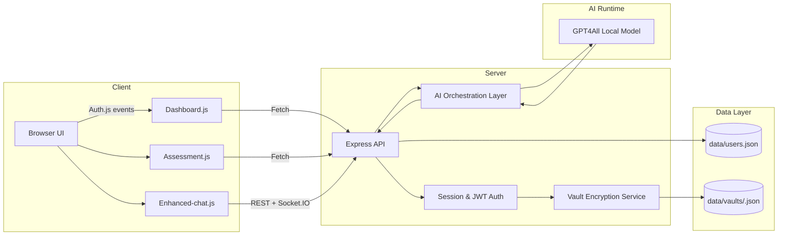
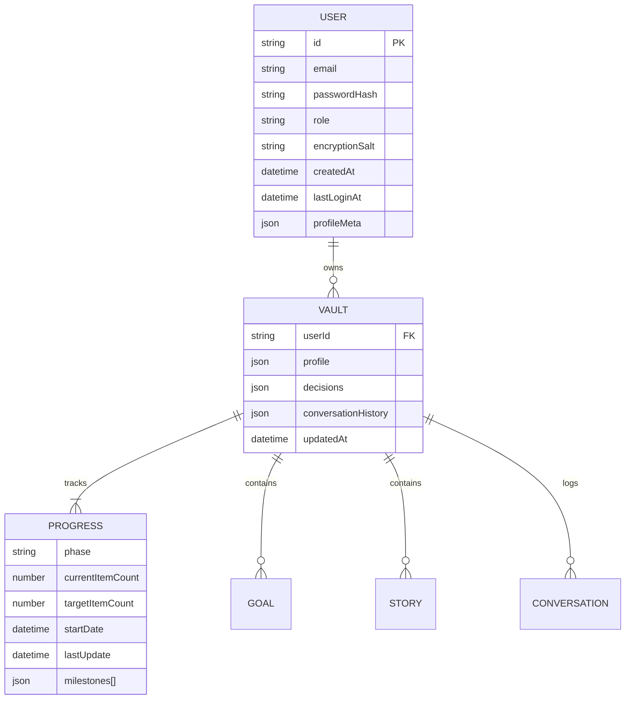
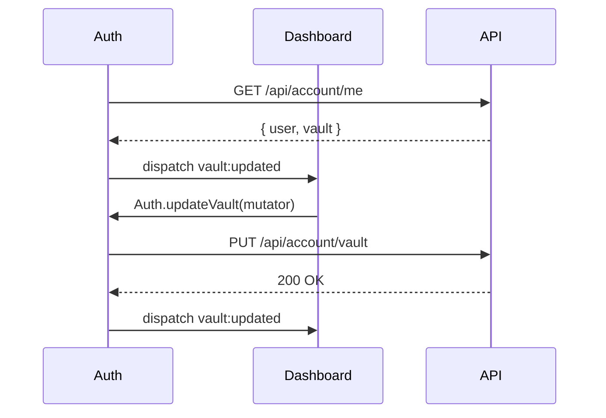
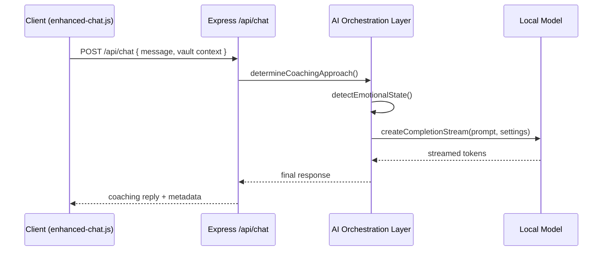

# Technical Architecture

## 1. System Overview

- **Client**: Single-page experiences (dashboard, assessment, chat) bootstrapped via `public/auth.js`.
- **Server**: Node/Express app with JWT/session auth, vault encryption utilities, and GPT4All orchestration.
- **Data Layer**: JSON-based persistence for user records and encrypted vaults.
- **AI Runtime**: Local GPT4All model loaded on boot, ensuring data stays on device.

## 2. Data Model (Logical Schema)

- **users.json**: Stores credential metadata (hashed), role, salts, audit timestamps.
- **vaults/<userId>.json**: AES-256-GCM encrypted payload containing profile, progress, goals, decisions, and conversation history.

## 3. API Reference (Key Endpoints)

| Method | Path | Auth | Description |
|--------|------|------|-------------|
| POST | `/api/register` | Public | Create account, derive encryption key, initialize vault |
| POST | `/api/login` | Public | Authenticate, issue JWT, unlock vault |
| POST | `/api/logout` | Authenticated | Revoke session and JWT |
| GET | `/api/account/me` | Authenticated | Retrieve sanitized user record + vault snapshot |
| GET | `/api/account/vault` | Authenticated | Fetch decrypted vault data |
| PUT | `/api/account/vault` | Authenticated | Persist updated vault content |
| POST | `/api/account/export` | Authenticated | Download full vault export |
| DELETE | `/api/account/conversations` | Authenticated | Purge conversation history |
| DELETE | `/api/account` | Authenticated | Right-to-be-forgotten account deletion |
| POST | `/api/assessment` | Authenticated | Submit assessment inputs; update profile & progress |
| GET | `/api/progress` | Authenticated | Retrieve progress summary |
| POST | `/api/progress` | Authenticated | Append progress milestone |
| POST | `/api/chat` | Optional | Generate AI coaching response |
| GET | `/api/admin/progress-summary` | Admin | Aggregated anonymized metrics |

## 4. Frontend Module Structure

- `public/auth.js`: Authentication overlay, vault synchronization, API helper.
- `public/dashboard.js`: Renders milestones, goals, phase summaries; listens for `vault:updated` events.
- `public/assessment.js`: Guided assessment workflow; persists profile data through `Auth.updateVault`.
- `public/enhanced-chat.js`: Conversational UI, handles Socket.IO stream and context injection.
- `public/shared-profile.js`: Shared profile state presenter for multiple views.
- HTML entrypoints (`index.html`, `dashboard.html`, `assessment.html`) load `auth.js` first to enforce login overlay.

### Component Interaction

## 5. AI Integration Flow

- **Prompt Assembly**: Combines minimalism prompt templates with vault context and emotional directives.
- **Emotional Safety**: Crisis keywords trigger grounding directives before streaming a reply.
- **Session Management**: `updateSessionContext` retains the last exchange for continuity while limiting prompt size.

## 6. Deployment Notes

- **Runtime**: Node.js with ES modules, GPT4All model loaded from local file.
- **Security**: JWT + express-session, PBKDF2 key derivation, AES-256-GCM vault encryption.
- **Scalability Considerations**: Replace JSON storage with managed DB (Postgres/Mongo) once multi-user concurrency grows; swap GPT4All with hosted LLM only after DPIA review.
